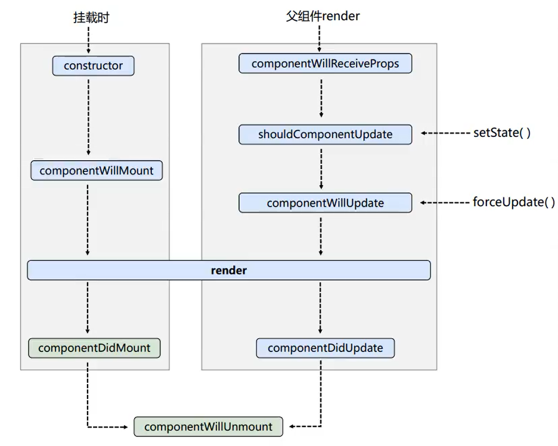
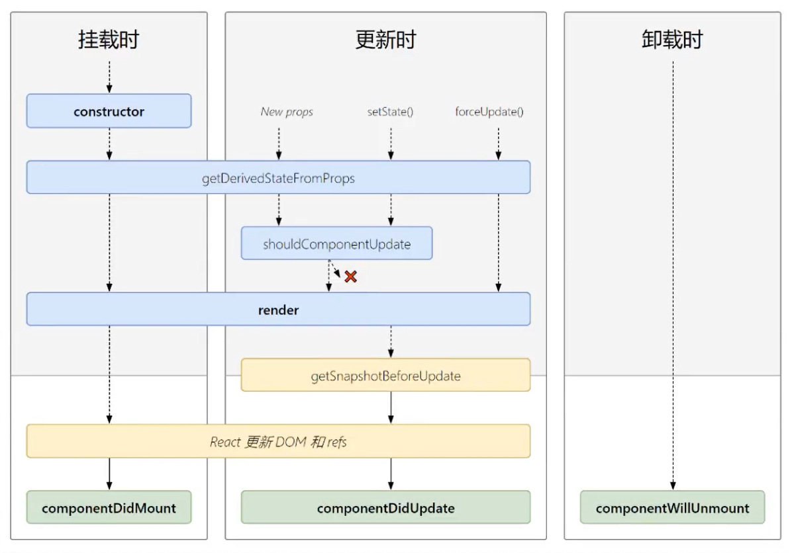
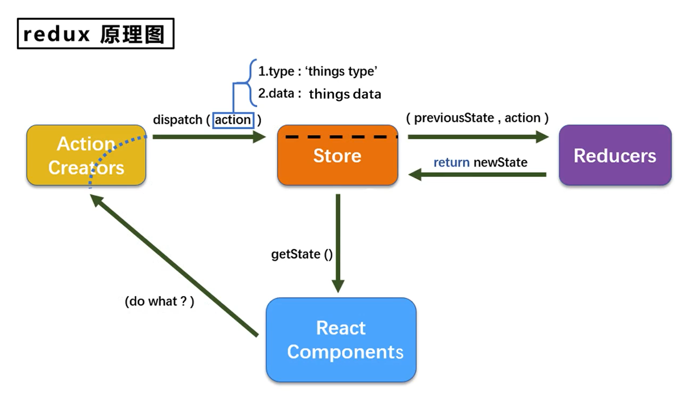
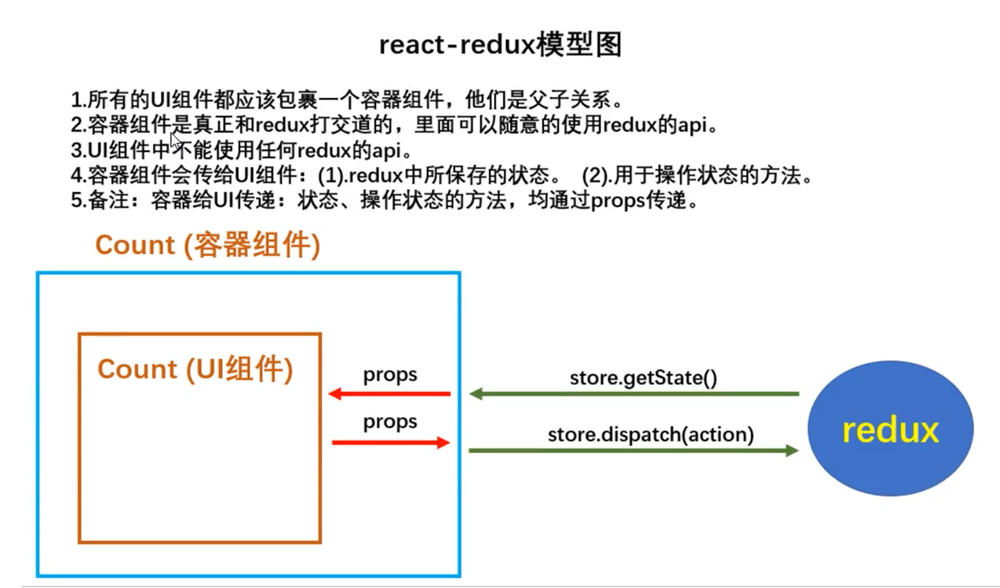
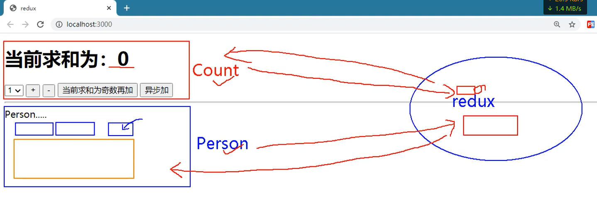

# React

## 第 1 章：React 入门 (15/16)

React

ReactDom

// q: What is ReactDom？
// a: ReactDom is a library that provides DOM-specific methods that can be used at the top level of a web app.

// q: why separate React and ReactDom?
// a: React is concerned with rendering components and keeping them up to date when their data changes. ReactDom is concerned with placing those components in the DOM and updating them when their data changes.

虚拟 DOM

```js
const vDom = React.createElement(
  'div', // 标签名
  { id: 'myDiv', title: 'div aaa' }, // 属性对象
  '这是一个div元素', // 子节点
  React.createElement('h1', null, '这是一个h1元素') // 子节点
)
```

// q: 工程化 in English
// a: Engineering
通过 `Babel` 将 `jsx` 语法转换为 `js` 语法

### 语法规则

using example

```html
<!DOCTYPE html>
<html lang="en">
  <head>
    <meta charset="UTF-8" />
    <title>React</title>
  </head>
  <body>
    <div id="app"></div>
    <script src="./node_modules/react/umd/react.development.js"></script>
    <script src="./node_modules/react-dom/umd/react-dom.development.js"></script>
    <script src="./node_modules/babel-standalone/babel.min.js"></script>
    <script type="text/babel">
      const vDom = React.createElement(
        'div', // 标签名
        { id: 'myDiv', title: 'div aaa' }, // 属性对象
        '这是一个div元素', // 子节点
        React.createElement('h1', null, '这是一个h1元素') // 子节点
      )
      ReactDOM.render(vDom, document.getElementById('app'))
    </script>
  </body>
</html>
```

## 第 2 章：React 面向组件编程

### 基本理解和使用

`jsx` 返回的是虚拟 DOM，不是真实 DOM，只有一个根元素

函数组件

```js
function App(props) {
  return (
    <div className="App">
      <h1>hello world</h1>
    </div>
  )
}
```

类组件

```js
class App extends React.Component {
  // 通常不写 `constructor` 函数，直接写 `state` 属性
  state = { count: 0 }
  increaseCount = () => {
    this.setState({ count: this.state.count + 1 })
  }

  showAlert = () => {
    setTimeout(() => {
      alert(this.state.count)
    }, 1000)
  }

  render() {
    return (
      <div className="App">
        <h1>hello world</h1>

        <h2>当前求和为：{this.state.count}</h2>
        <input type="button" value="点我+1" onClick={this.increaseCount} />
      </div>
    )
  }
}
```

组件中`jsx`中`this`指向的是组件对象，绑定到`jsx`中的函数通常用**箭头函数**声明的组件实例的方法，这样子可以在方法中获取组件实例

### 组件三大核心属性 1：state

类组件可以获取到 state 属性，函数组件不能获取到 state 属性，但是可以通过 useState 钩子函数获取到 state 属性
设置 state 值使用 setState 方法

```js
class App extends React.Component {
  state = {
    count: 0,
  }
  increment = () => {
    // 不能直接修改state， 合并修改，只修改参数中的属性
    this.setState({
      count: this.state.count + 1,
    })
  }
  render() {
    return (
      <div className="App">
        <h1>hello world</h1>
        <h2>当前求和为：{this.state.count}</h2>
        <input type="button" value="点我+1" onClick={this.increment} />
      </div>
    )
  }
}
```

### 组件三大核心属性 2：props

类组件可以获取到 props 属性，函数组件可以获取到 props 属性

function component

```js
function MyComponent(props) {
  return <div>{props.name}</div>
}
function App(props) {
  return <MyComponent name="tom" age={18} />
}
```

class components

```js
// 15 版本之前 的 PropTypes 在react 库
// 15 版本之后 的 PropTypes 在prop-types 库
class App extends React.Component {
  render() {
    const { name, age } = this.props
    return <MyComponent name={name} age={age} />
  }
  render() {
    // jsx 中多传递的属性会自动传递给组件，展开语法
    return <MyComponent {...this.props} />
  }
}
// 类型检查
App.PropTypes = {
  // 15 版本之前
  name: React.PropTypes.string.isRequired,
  age: React.PropTypes.number.isRequired,
  // 15 版本之后
  name: PropTypes.string.isRequired,
  age: PropTypes.number.isRequired,
}
// 默认值
App.defaultProps = {
  name: 'jack',
  age: 18,
}
```

### 组件三大核心属性 3：refs 与事件处理

字符串 ref（不推荐）

```js
class App extends React.Component {
  state = {
    count: 0,
  }
  increment = () => {
    // 不能直接修改state， 合并修改，只修改参数中的属性
    this.setState({
      count: this.state.count + 1,
    })
  }
  show = () => {
    alert(this.refs.myRef.value)
  }
  render() {
    return (
      <div className="App">
        <h1>hello world</h1>
        <h2>当前求和为：{this.state.count}</h2>
        <input type="button" value="点我+1" onClick={this.increment} />
        <input type="text" ref="myRef" />
        <input type="button" value="点我提示数据" onClick={this.show} />
      </div>
    )
  }
}
```

回调 ref（常用）
每次更新 dom，会多次执行回调（createRef 可以解决这个问题，但是多次调用问题不大）

```js
class App extends React.Component {
  state = {
    count: 0,
  }
  increment = () => {
    // 不能直接修改state， 合并修改，只修改参数中的属性
    this.setState({
      count: this.state.count + 1,
    })
  }
  show = () => {
    alert(this.myRef.value)
  }
  render() {
    return (
      <div className="App">
        <h1>hello world</h1>
        <h2>当前求和为：{this.state.count}</h2>
        <input type="button" value="点我+1" onClick={this.increment} />
        <input type="text" ref={(c) => (this.myRef = c)} />
        <input type="button" value="点我提示数据" onClick={this.show} />
      </div>
    )
  }
}
```

createRef

```js
class App extends React.Component {
  state = {
    count: 0,
  }
  increment = () => {
    // 不能直接修改state， 合并修改，只修改参数中的属性
    this.setState({
      count: this.state.count + 1,
    })
  }
  show = () => {
    alert(this.myRef.current.value)
  }
  myRef = React.createRef()
  render() {
    return (
      <div className="App">
        <h1>hello world</h1>
        <h2>当前求和为：{this.state.count}</h2>
        <input type="button" value="点我+1" onClick={this.increment} />
        <input type="text" ref={this.myRef} />
        <input type="button" value="点我提示数据" onClick={this.show} />
      </div>
    )
  }
}
```

### 收集表单数据

非受控组件(现用现取--eg: handleSubmit 时获取 input 的值)

```js
class Login extends React.Component {
  handleSubmit = (event) => {
    const { username, password } = this
    event.preventDefault()
    alert(`username:${username.value},password:${password.value}`)
  }

  render() {
    return (
      <form onSubmit={this.handleSubmit} action="/login">
        <div>
          <label htmlFor="username">用户名：</label>
          <input type="text" id="username" ref={(c) => (this.username = c)} />
        </div>
        <div>
          <label htmlFor="password">密码：</label>
          <input
            type="password"
            id="password"
            ref={(c) => (this.password = c)}
          />
        </div>
        <div>
          <input type="submit" value="登录" />
        </div>
      </form>
    )
  }
}
```

受控组件（变化就更新状态，用的时候从状态取，类似于 vue 的双向绑定）

```js
class Login extends React.Component {
  state = {
    username: '',
    password: '',
  }
  handleSubmit = (event) => {
    const { username, password } = this.state
    event.preventDefault()
    alert(`username:${username},password:${password}`)
  }
  handleUsernameChange = (event) => {
    this.setState({
      username: event.target.value,
    })
  }
  handlePasswordChange = (event) => {
    this.setState({
      password: event.target.value,
    })
  }
  render() {
    const { username, password } = this.state
    return (
      <form onSubmit={this.handleSubmit} action="/login">
        <div>
          <label htmlFor="username">用户名：</label>
          <input
            type="text"
            id="username"
            value={username}
            onChange={this.handleUsernameChange}
          />
        </div>
        <div>
          <label htmlFor="password">密码：</label>
          <input
            type="password"
            id="password"
            value={password}
            onChange={this.handlePasswordChange}
          />
        </div>
        <div>
          <input type="submit" value="登录" />
        </div>
      </form>
    )
  }
}
```

高阶函数 函数柯里化

concepts:

高阶函数：如果一个函数符合下面 2 个规范中的任何一个，那该函数就是高阶函数。

- 1.若 A 函数，接收的参数是一个函数，那么 A 就可以称之为高阶函数。
- 2.若 A 函数，调用的返回值依然是一个函数，那么 A 就可以称之为高阶函数。

eg: Promise, arr.map(()=>{})

函数的柯里化：通过函数调用继续返回函数的方式，实现多次接收参数最后统一处理的函数编码形式。

```js
class Login extends React.Component {
  state = {
    username: '',
    password: '',
  }
  handleSubmit = (event) => {
    const { username, password } = this.state
    event.preventDefault()
    alert(`username:${username},password:${password}`)
  }
  // 合并了 handlePasswordChange, handleUsernameChange; 高阶函数 函数柯里化
  handleChange = (key) => {
    return (event) => {
      this.setState({
        [key]: event.target.value,
      })
    }
  }
  render() {
    const { username, password } = this.state
    return (
      <form onSubmit={this.handleSubmit} action="/login">
        <div>
          <label htmlFor="username">用户名：</label>
          <input
            type="text"
            id="username"
            value={username}
            onChange={this.handleChange('username')}
          />
        </div>
        <div>
          <label htmlFor="password">密码：</label>
          <input
            type="password"
            id="password"
            value={password}
            onChange={this.handleChange('password')}
          />
        </div>
        <div>
          <input type="submit" value="登录" />
        </div>
      </form>
    )
  }
}
```

非柯里化实现更新多个状态

```js
class Login extends React.Component {
  state = {
    username: '',
    password: '',
  }
  handleSubmit = (event) => {
    const { username, password } = this.state
    event.preventDefault()
    alert(`username:${username},password:${password}`)
  }
  //   内联处用匿名函数
  handleChange = (key, event) => {
    this.setState({
      [key]: event.target.value,
    })
  }
  render() {
    const { username, password } = this.state
    return (
      <form onSubmit={this.handleSubmit} action="/login">
        <div>
          <label htmlFor="username">用户名：</label>
          <input
            type="text"
            id="username"
            value={username}
            onChange={(e) => this.handleChange('username', e)}
          />
        </div>
        <div>
          <label htmlFor="password">密码：</label>
          <input
            type="password"
            id="password"
            value={password}
            onChange={(e) => this.handleChange('password', e)}
          />
        </div>
        <div>
          <input type="submit" value="登录" />
        </div>
      </form>
    )
  }
}
```

### 组件生命周期

```html
<div id="root"></div>
```

```js
class Blink extends React.Component {
  state = {
    opacity: 1,
  }
  handleDie = (key, event) => {
    ReactDom.unmountComponentAtNode(document.getElementById('root'))
  }
  //   组件挂载完成
  componentDidMount() {
    console.log('componentDidMount')
    this.timer = setInterval(() => {
      let { opacity } = this.state
      opacity -= 0.05
      if (opacity <= 0) {
        opacity = 1
      }
      this.setState({
        opacity,
      })
    }, 100)
  }
  //   组件更新完成
  componentDidUpdate() {
    console.log('componentDidUpdate')
  }
  //   组件卸载
  componentWillUnmount() {
    console.log('componentWillUnmount')
    clearInterval(this.timer)
  }
  render() {
    const { username, password } = this.state
    return (
      <div>
        <div style={{ opacity: this.state.opacity }}> hello !!! </div>
        <button onClick={this.handleDie}> die </button>
      </div>
    )
  }
}
```

#### 生命周期流程（旧）



旧生命周期--初始化挂载相关钩子函数

```js
class Clock extends React.Component {
  constructor(props) {
    console.log('count---constructor')
    super(props)
    this.state = {
      count: 0,
    }
  }
  add = () => {
    const { count } = this.state
    this.setState({
      count: count + 1,
    })
  }
  die = () => {
    ReactDom.unmountComponentAtNode(document.getElementById('root'))
  }

  // life cycle
  componentWillMount() {
    console.log('count---componentWillMount')
  }
  componentDidMount() {
    console.log('count---componentDidMount')
  }

  componentWillUnmount() {
    console.log('count---componentWillUnmount')
  }

  render() {
    console.log('count---render')
    return (
      <div>
        <h1>count: {this.state.count}</h1>
        <button onClick={this.add}>add</button>
        <button onClick={this.die}>die</button>
      </div>
    )
  }
}
```

旧生命周期--- setState/forceUpdate

```js
class Clock extends React.Component {
  constructor(props) {
    console.log('count---constructor')
    super(props)
    this.state = {
      count: 0,
    }
  }
  add = () => {
    const { count } = this.state
    this.setState({
      count: count + 1,
    })
  }
  die = () => {
    ReactDom.unmountComponentAtNode(document.getElementById('root'))
  }
  updateView = () => {
    this.forceUpdate() // 即使 shouldComponentUpdate 返回 false，也会强制更新
  }

  // life cycle
  componentWillMount() {
    console.log('count---componentWillMount')
  }
  componentDidMount() {
    console.log('count---componentDidMount')
  }

  componentWillReceiveProps() {
    console.log('count---componentWillReceiveProps')
  }

  // 控制组件是否更新
  // 如果没有重写 shouldComponentUpdate()，默认返回 true
  // 如果返回 false，不会执行后面的生命周期函数
  shouldComponentUpdate() {
    console.log('count---shouldComponentUpdate')
    return true
  }
  componentWillUpdate() {
    console.log('count---componentWillUpdate')
  }
  componentDidUpdate() {
    console.log('count---componentDidUpdate')
  }

  componentWillUnmount() {
    console.log('count---componentWillUnmount')
  }

  render() {
    console.log('count---render')
    return (
      <div>
        <h1>count: {this.state.count}</h1>
        <button onClick={this.add}>add</button>
        <button onClick={this.die}>die</button>
        <button onClick={this.updateView}>update view</button>
      </div>
    )
  }
}
```

旧生命周期--- 父组件 render

```js
class Parent extends React.Component {
  state = {
    carName: '奔驰c63',
  }
  changeCar = () => {
    this.setState({
      carName: '宝马m3',
    })
  }
  render() {
    console.log('parent---render')
    return (
      <div>
        <h1>parent</h1>
        <button onClick={this.changeCar}>change car</button>
        <Child carName={this.state.carName} />
      </div>
    )
  }
}

class Child extends React.Component {
  componentWillReceiveProps(props) {
    // 初始化挂载时不会执行，只有父组件 render 时才会执行
    console.log('child---componentWillReceiveProps')
  }
  render() {
    console.log('child---render')
    const { carName } = this.props
    return (
      <div>
        <h2>child</h2>
        <div>car name from parent: {carName}</div>
      </div>
    )
  }
}
```

#### 总结---旧

1. 初始化阶段：由 ReactD0M.render()触发---初次渲染

   1. constructor()
   2. componentwillMount()
   3. render() 必须有
   4. componentDidMount() 常用，一般在这里做初始化的操作如：开启定时器，网络请求，订阅消息等

2. 更新阶段：由组件内部 this.setSate()或父组件 render 触发

   1. shouldComponentUpdate()
   2. componentwillUpdate()
   3. render()
   4. componentDidUpdate()

3. 卸载组件：由 ReactDOM.unmountComponentAtNode()触发
   1. componentWillUnmount() 常用，一般在这里做清理操作如：清除定时器，取消订阅消息等

#### 新旧生命周期对比




- 即将废弃的勾子
  1. componentWillMount
  2. componentWillReceiveProps
  3. componentWillUpdate

#### 生命周期流程（新）


新生命周期--初始化挂载相关钩子函数

```js
class Clock extends React.Component {
  constructor(props) {
    console.log('count---constructor')
    super(props)
    this.state = {
      count: 0,
    }
  }
  add = () => {
    const { count } = this.state
    this.setState({
      count: count + 1,
    })
  }
  die = () => {
    ReactDom.unmountComponentAtNode(document.getElementById('root'))
  }

  // life cycle
  /**
   * 需要返回 状态对象 或者 null
   * 如果返回状态对象，会和 this.state 合并
   * 如果返回 null，不会更新 state
   * 适用情况：如果 state 的值在任何时候都取决于 props，那么就可以使用这个生命周期函数
   * 状态派生会导致代码冗余，并使组件难以维护
   * @param {any} props
   * @param {any} state
   * @returns {any} state object | null
   */
  static getDerivedStateFromProps(props, state) {
    console.log('count---getDerivedStateFromProps')
    return null
  }

  /**
   * return 的值将作为参数传递给 componentDidUpdate()
   * @returns {any} null | snapshot value
   */
  getSnapshotBeforeUpdate() {
    console.log('count---getsnapshotBeforeUpdate')
    return null
  }
  componentDidUpdate(prevProps, prevState, snapshotValue) {
    console.log('count---componentDidUpdate')
  }

  componentDidMount() {
    console.log('count---componentDidMount')
  }

  componentWillUnmount() {
    console.log('count---componentWillUnmount')
  }

  render() {
    console.log('count---render')
    return (
      <div>
        <h1>count: {this.state.count}</h1>
        <button onClick={this.add}>add</button>
        <button onClick={this.die}>die</button>
      </div>
    )
  }
}
```

#### 总结---新

1. 初始化阶段：由 ReactDOM.render()触发--初次渲染
   1.constructor()
   2.getDerivedstateFromProps
   3.render() 必须有
   4.componentDidMount()===>常用 般在这个钩子中做一些初始化的事，例如：开启定时器、发送网络请求、订阅消息

2. 更新阶段：由组件内部 this.setSate()或父组件重新 render 触发
   1.getDerivedstateFromProps
   2.shouldComponentUpdate()
   3.render()
   4.getSnapshotBeforeUpdate
   5.componentDidUpdate()

3. 卸载组件：由 ReactDOM.unmountComponentAtNode()触发
   1.componentwillUnmount()=====>常用 般在这个钩子中做一些收尾的事，例如：关闭定时器、取消订阅消息

### 拟 DOM 与 DOM Dif 算法

经典面试题 ：
1 ）react/vue 中的 key 有什么作用 ？ (key 的内部原理是什么 ？)
2 ）为什么遍历列表时 ， key 最好不要 index?

1. 虚拟 DOM 中 key 的作用 ：
   1. 简单的说 ： key 是虚拟 DOM 对象的标识 ， 在更新显示时 key 起着极其重要的作用 。
   2. 详细的说 ： 当状态中的数据发生变化时 ， react 会根据新数据生成新的虚拟 DOM,随后 React 进行 新虚拟与旧虚拟 DOM 的 diff 比较， 比较规则如下 ：
      1. 旧虚拟 DOM 中找到了与新虚拟 DOM 相同的 key ：
         1. 若虚拟中内容没变 ， 直接使用之前的真实 DOM
         2. 若虚拟中内容变了 ， 则生成新的真实 DOM ， 随后替换掉页面中之前的真实 DOM
      2. 旧虚拟 DOM 中未找到与新虚拟 DOM 相同的 key 根据数据创建新的真实 DOM ， 随后渲染到到页面
2. 月 index 作为 key 可能会引发的问题 ：

   1. 若对数据进行 ： 逆序添加 、 逆序删除等破坏顺序操作 ：会产生没有必要的真实 DOM 更新 ==> 界面效果没问题, 但效率低。
   2. 如果结构中还包含输入类的 DOM ：会产生错误 DOM 更新 == > 界面有问题。
   3. 注意 ！ 如果不存在对数据的逆序添加 、 逆序删除等破坏顺序操作，仅用于渲染列表用于展示， 使用 index 作为 key 是没有问題的 。

3. 开发中如何选择 key ？ ：
   1. 最好使用每条数据的唯一标识作为 key ， 比如 id 、 手机号 、 身份证号 、 学号等唯一值 。
   2. 如果确定只是简单的展示数据 ， 用 index 也是可以的 。

`index`作为`key`引起的问题（全部重新渲染，如果又输入组件还可能引起错乱）

```js
class List extends React.Component {
  state = {
    list: [
      { id: 1, name: 'tom' },
      { id: 2, name: 'jerry' },
      { id: 3, name: 'kitty' },
    ],
  }
  add = () => {
    const { list } = this.state
    this.setState({
      // 因为用index作为key，导致每次在表头插入数据都会全部重新渲染
      list: [{ id: list.length + 1, name: 'new' }, ...list],
    })
  }
  render() {
    const { list } = this.state
    return (
      <div>
        <button onClick={this.add}>add</button>
        <ul>
          {list.map((item, index) => (
            <li key={index}>
              {item.name}
              <input type="text" />
            </li>
          ))}
        </ul>
      </div>
    )
  }
}
```

应该用唯一标识作为`key`（只渲染新增的数据，输入元素也没问题）

```js
class List extends React.Component {
  state = {
    list: [
      { id: 1, name: 'tom' },
      { id: 2, name: 'jerry' },
      { id: 3, name: 'kitty' },
    ],
  }
  add = () => {
    const { list } = this.state
    this.setState({
      // 因为用id作为key，导致每次在表头插入数据只会渲染新增的数据
      list: [{ id: list.length + 1, name: 'new' }, ...list],
    })
  }
  render() {
    const { list } = this.state
    return (
      <div>
        <button onClick={this.add}>add</button>
        <ul>
          {list.map((item, index) => (
            <li key={item.id}>
              {item.name}
              <input type="text" />
            </li>
          ))}
        </ul>
      </div>
    )
  }
}
```

## 第 3 章：react 应用（基于 react 脚手架）

1. cli

   ```shell
   npm install -g create-react-app
   create-react-app react-app
   ```

   暴露配置文件

   ```shell
   yarn eject

   ```

2. 包含配置

   - 语法检查
   - eslint
   - devServer
   - 。。。

3. 项目的整体技术架构为 ： rea ct + webpack + es6 + eslint
4. 使用脚手架开发的项目的特点 ： 模块化 ， 组件化 ， 工程化

### 脚手架项目结构

- public --- 静态资源文件夹
  - favicon.icon - 网站图标
  - index.html - 应用的入口页面!!!
  - manifest.json - 应用加壳的配首文件
  - robots.txt - 爬虫协议文件
- src
  - App.js - 根组件!!!
  - index.js - 入口 js!!!
  - reportWebVitals.js - 性能监控的库 web-vitals---性能监控的库
  - setupTests.js - 测试相关的配置文件

### 样式的模块化

Hello/index.module.css

```css
.title {
  color: red;
}
```

Hello/index.jsx

```jsx
import React, { Component } from 'react'
import styles from './index.module.css'
export default class Hello extends Component {
  render() {
    return <h2 className={styles.title}>Hello, React!</h2>
  }
}
```

或者 less

Hello/index.less

```less
.hello {
  &.title {
    color: red;
  }
}
```

Hello/index.jsx

```jsx
import React, { Component } from 'react'
import './index.less'
export default class Hello extends Component {
  render() {
    return (
      <div className="hello">
        <h2 className="title">Hello, React!</h2>
      </div>
    )
  }
}
```

### 界面的组件化编码流程

1. 拆分组件，拆分界面，抽取组件
2. 实现静态组件，适用静态组件实现静态页面效果
3. 实现动态组件
   1. 动态显示初始化数据
      1. 数据类型
      2. 数据名称
      3. 保存在哪个组件
   2. 交互（从绑定事件监听开始）

### 父子组件通信

子组件通过 props 接受父组件传递过来的数据，父组件通过 props 传递数据给子组件
子组件通过调用父组件传递过来的方法，来实现父组件的数据更新，eg：changeCar

```jsx
// 父组件
import React, { Component } from 'react'
export default class Parent extends Component {
  state = { carName: '奔驰c63' }
  changeCar = (newName) => {
    // 状态属于哪个组件，操作状态的方法就定义在哪个组件，就是说 操作状态的方法定义在状态所属的组件中
    this.setState({ carName: newName })
  }
  render() {
    const { carName } = this.state
    return (
      <div>
        <h3>我是Parent组件</h3>
        <h4>我有一个奔驰车：{carName}</h4>
        <Child carName={carName} changeCar={this.changeCar} />
      </div>
    )
  }
}

// 子组件
export default class Child extends Component {
  state = { carName: '奔驰c63' }
  changeCar = () => {
    const { carName } = this.state
    this.props.changeCar(carName)
  }
  render() {
    const { carName } = this.props
    return (
      <div>
        <h3>我是Child组件</h3>
        <h4>我从Parent组件接收到的车名：{carName}</h4>
        <button onClick={this.changeCar}>点我换车</button>
      </div>
    )
  }
}
```

一些坑

```html
<input type="checkbox" checked="{true}" />
<!-- 这样写不行，会报错 -->

<input type="checkbox" defaultChecked={checkCount === total} />
<!-- 只会在第一次渲染checkCount === total表达式值的结果，条件变更后不会生效 -->
```

### todo list 案例相关知识点

1. 拆分组件 、 实现静态组件 ， 注意 ： c1assName 、 style 的写法
2. 动态初始化列表 ， 如何确定将数据放在哪个组件的 state 中 ？

   - 某个组件使用 ： 放在其自身的 state 中
   - 某些组件使用 ： 放在他们共同的父组件 state 中 （ 官方称此操作为 ： 状态提升 ）

3. 关于父子之间通信 ：
   1. 〖 父组件 〗 给 〖 子组件 〗 传递数据 ： 通过 props 传递
   2. 〖 子组件 〗 给 〖 父组件 〗 传递数据 ： 通过 props 传递 ， 要求父提前给子传递一个函数
4. 注意 defaultChecked 和 checked 的区别，类似的还有 ： defaultVaIue 和 value
5. 状态在哪里 ， 操作状态的方法就在哪里

## 第 4 章：react ajax

前置说明

- React 本身只关注于界面 ， 并不包含发送 aJax 请求的代码
- 前端应用需要通过 ajax 清求与后台进行交互 （json 数据）
- react 应用中需要集成第三方库 （或自己封装）

1. jQuery: 比较重 ， 如果需要另外引入不建议使用
2. axios: 轻量级 ， 建议使用

   - 封装 XmlHttpRequest 对象的 ajax
   - promise 风格
   - 可以用在浏览器端和 node 服务器端

### devserver 代理

方式 1
package.json
假如本地前端服务是 3000 端口，后端服务是 5000 端口，前端请求的接口是 5000 端口，那么就需要配置代理解决跨域
在前端没有的资源就会转发到后端

```json
{
  "proxy": "http://localhost:5000"
}
```

优点：简单，前端请求资源时不需要加前缀
缺点：只能代理一个，不能配置多个
工作方式：当请求的资源不是前端的资源时，就会转发到后端

方式 2
在 src 目录下创建一个名为 setupProxy.js 的文件，内容如下
只能用 commonjs 语法!!!

```js
const proxy = require('http-proxy-middleware')
module.exports = function (app) {
  app.use(
    proxy('/api1', {
      // 遇见 /api1 前缀的请求，就会触发该代理配置
      target: 'http://localhost:5000', // 请求转发给谁
      changeOrigin: true, // 控制服务器收到的请求头中 host 字段的值
      pathRewrite: { '^/api1': '' }, // 重写请求路径（必须）
    }),
    proxy('/api2', {
      target: 'http://localhost:5001',
      changeOrigin: true,
      pathRewrite: { '^/api2': '' },
    })
  )
}
```

优点：可以配置多个代理，灵活控制是否走代理
缺点：配置繁琐，前端请求资源时需要加前缀

### 兄弟组件通信

1. 通过父组件作为中介

   1. 通过 redux

   ```jsx
   import React, { Component } from 'react'
   // 父组件
   export default class Parent extends Component {
     state = { carName: '奔驰c63' }
     changeCar = (newName) => {
       // 状态属于哪个组件，操作状态的方法就定义在哪个组件，就是说 操作状态的方法定义在状态所属的组件中
       this.setState({ carName: newName })
     }
     render() {
       const { carName } = this.state
       return (
         <div>
           <h3>我是Parent组件</h3>
           <h4>我有一个奔驰车：{carName}</h4>
           <Child carName={carName} changeCar={this.changeCar} />
           <Child2 carName={carName} changeCar={this.changeCar} />
         </div>
       )
     }
   }

   // 子组件
   export default class Child extends Component {
     state = { carName: '劳斯莱斯' }
     changeCar = () => {
       const { carName } = this.state
       this.props.changeCar(carName)
     }
     render() {
       const { carName } = this.props
       return (
         <div>
           <h3>我是Child组件</h3>
           <h4>我从Parent组件接收到的车名：{carName}</h4>
           <button onClick={this.changeCar}>点我换车</button>
         </div>
       )
     }
   }

   // 子组件2
   export default class Child2 extends Component {
     state = { carName: '法拉利' }
     changeCar = () => {
       const { carName } = this.state
       this.props.changeCar(carName)
     }
     render() {
       const { carName } = this.props
       return (
         <div>
           <h3>我是Child2组件</h3>
           <h4>我从Parent组件接收到的车名：{carName}</h4>
           <button onClick={this.changeCar}>点我换车</button>
         </div>
       )
     }
   }
   ```

2. 通过消息订阅/发布机制

   ```jsx
   import React, { Component } from 'react'
   import PubSub from 'pubsub-js'
   // 父组件
   export default class Parent extends Component {
     render() {
       return (
         <div>
           <h3>我是Parent组件</h3>
           <Child />
           <Child2 />
         </div>
       )
     }
   }

    // 子组件
    export default class Child extends Component {
      state = { carName: '劳斯莱斯' }
      changeCar = () => {
        const { carName } = this.state
        PubSub.publish('changeCar', carName)
      }
      render() {
        const { carName } = this.props
        return (
          <div>
            <h3>我是Child组件</h3>
            <button onClick={this.changeCar}>点我换车</button>
          </div>
        )
      }
    }

    // 子组件2
    export default class Child2 extends Component {
      state = { carName: '法拉利' }

      componentDidMount() {
      this.token =  PubSub.subscribe('changeCar', (msg, carName) => {
          this.setState({ carName })
        })
      }
      componentWillUnmount() {
        PubSub.unsubscribe(this.token)
      }
      render() {
        const { carName } = this.props
        return (
          <div>
            <h3>我是Child2组件</h3>
            <h4>我从Child组件接收到的车名：{carName}</h4>
           </div>
        )
      }
    }
   ```

## 第 5 章：react-router

### SPA 单页面应用

1. 单页 Web 应用 (single page web application, SPA) 。
2. 个应用只有一个完整的页面 。
3. 点击页面中的逞妾不会刷新页面 ， 只会做页面的局部更新 。
4. 数据都需要通过 ajax 请求获取 ， 并在前端异步展现 。

#### 路由原理

> route 路由
> router 路由器

1. 什么是路由？
   1. 路由是指根据不同的 url 显示不同的内容
   2. 路由是一种映射关系
2. 路由分类
   1. 前端路由
      1. 工作过程：浏览器监听 url，通过前端的 js 代码来实现局部内容更新
      2. 前端路由的实现方式
         1. hash 路由
         2. history 路由
   2. 后端路由
      1. 工作过程：后端服务处理客户端请求，根据不同的路径，调用不同的逻辑代码来处理请求，返回对应的结果

> 前端中 BOM 操作浏览器历史记录
> history 记录是一个栈结构，每次 pushState 在栈顶添加一个记录，replaceState 会替换栈顶的记录,当点击浏览器的前进后退按钮时，就会在这个栈里面进行前进后退操作。

```html
<!-- link history.js -->
<script src="https://cdn.bootcdn.net/history.js"></script>
<div onclick="push('/home')">home</div>
```

```js
const history = History.createBrowserHistory() // html5
// const history = History.createHashHistory()
function push(path) {
  history.push(path)
}
```

#### 路由基本使用

react-router-dom

1. react 的一个届件库 。
2. 专门用来实现一个 SPA 应用 。
3. 基于 react 的项目基本都会用到此库 。

> BrowserRouter
> HashRouter
> Link
> NavLink 激活的时候会有一个类名 active，可以自定义，activeClassName="xxx"
> Route

index.js

```js
import React from 'react'
import ReactDOM from 'react-dom'
import { BrowserRouter } from 'react-router-dom'
import App from './App'

// 一般一个应用只有一个路由器，所以一般都是在 index.js 中使用，把路由器包裹在最外层
ReactDOM.render(
  <BrowserRouter>
    <App />
  </BrowserRouter>,
  document.getElementById('root')
)
```

App.js

```jsx
import React, { Component } from 'react'
import { Route, Link } from 'react-router-dom'
import Home from './pages/Home'
import About from './pages/About'
export default class App extends Component {
  render() {
    return (
      <div>
        <div>
          <Link to="/about">About</Link>
          <Link to="/home">Home</Link>
        </div>
        <div>
          <Route path="/about" component={About} />
          <Route path="/home" component={Home} />
        </div>
      </div>
    )
  }
}
```

Home.jsx

```jsx
import React, { Component } from 'react'
export default class Home extends Component {
  render() {
    return <div>Home</div>
  }
}
```

About.jsx

```jsx
import React, { Component } from 'react'
export default class About extends Component {
  render() {
    return <div>About</div>
  }
}
```

#### 路由组件与一般组件

1. 使用方法不同
   1. 一般组件： `<Header />`
   2. 路由组件： `<Route to="home" component={Home} />`
2. 存放位置不同
   1. 一般组件：components
   2. 路由组件：pages
3. 接收到的 props 不同
   1. 一般组件：写组件标签时传递了什么，就能收到什么
   2. 路由组件：接收到三个固定的属性
      1. history
         1. go: ƒ go(n)
         2. goBack: ƒ goBack()
         3. goForward: ƒ goForward()
         4. push: ƒ push(path, state)
         5. replace: ƒ replace(path, state)
      2. location
         1. hash: ""
         2. key: "5nvxpj"
         3. pathname: "/about"
         4. search: ""
         5. state: undefined
      3. match
         1. isExact: true
         2. params: {}
         3. path: "/about"
         4. url: "/about"

二次封装 NavLink
知识点：

- jsx 属性扩展
- 标签体也是一种特殊的属性

MyNavLink.jsx

```jsx
import React, { Component } from 'react'
import { NavLink } from 'react-router-dom'
export default class MyNavLink extends Component {
  render() {
    return <NavLink {...this.props} activeClassName="activeClass" />
  }
}
```

App.js

```jsx
import React, { Component } from 'react'
import { Route, Link } from 'react-router-dom'
import Home from './pages/Home'
import About from './pages/About'
import MyNavLink from './components/MyNavLink'
export default class App extends Component {
  render() {
    return (
      <div>
        <div>
          <MyNavLink to="/about">About</MyNavLink>
          <MyNavLink to="/home">Home</MyNavLink>
        </div>
        <div>
          <Route path="/about" component={About} />
          <Route path="/home" component={Home} />
        </div>
      </div>
    )
  }
}
```

#### Switch 的使用

> 如果 path 和 url 都能匹配上，那么所有匹配上的 Route 都会被渲染
> 如果使用了 Switch，只会渲染和当前路径匹配的第一个 Route

1. 通常情况下，path 和 component 是一一对应的关系
2. Switch 可以提高路由匹配效率（单一匹配）

```jsx
import { Route, Switch } from 'react-router-dom'
```

```jsx
<Switch>
  <Route path="/about" component={About} />
  <Route path="/home" component={Home} />
</Switch>
```

#### 解决样式丢失的问题

出现问题现场:
index.html

```html
<link rel="stylesheet" href="./css/bootstrap.min.css" />
```

存在多级路由

```jsx
<Route path="/level/about" component={About} />
<Route path="/level/home" component={Home} />
```

刚进入根目录时候没问题，当进入某个 route 后，刷新页面，引入的样式就丢失了

解决办法：

1. public/index.html 中使用绝对路径引入 bootstrap 的样式
2. 在 index.js 中引入 bootstrap 的 js 文件
3. 使用 HashRouter(少用)

```html
<link rel="stylesheet" href="/css/bootstrap.min.css" />
<!-- or -->
<link rel="stylesheet" href="%PUBLIC_URL%/css/bootstrap.min.css" />
```

```jsx
import 'bootstrap/dist/css/bootstrap.min.css'
import 'bootstrap/dist/js/bootstrap.bundle.min'
```

```jsx
import { HashRouter } from 'react-router-dom'
ReactDOM.render(
  <HashRouter>
    <App />
  </HashRouter>,
  document.getElementById('root')
)
```

> 安装包的时候统一用一个包管理工具，不要混用，yarn add xxx, npm i yyy

#### 模糊匹配与严格匹配

NavLink to 与 Route Path 匹配过程

```jsx
<NavLink to="/home" activeClassName="activeClass">Home</NavLink>
<NavLink to="/about/a/b" activeClassName="activeClass">About</NavLink>
<NavLink to="/contact" activeClassName="activeClass">Contact</NavLink>

<Route path="/home" component={About} />
// 可以匹配到 Home 组件

<Route path="/about" component={About} />
// 可以匹配到 About 组件

<Route path="/contact/a/b" component={Contact} />
// 不可以匹配到 Contact 组件

```

1. 默认使用的是模糊匹配（简写模式）
2. 开启严格匹配 `<Route exact={true} path="/about" component={About} />`

开启严格匹配条件：
如果没有其他奇怪的需求，一般都**不开启**严格匹配，有时候开启严格匹配会导致二级路由无法匹配

#### redirect 使用

```jsx
import { Redirect } from 'react-router-dom'
```

```jsx
<Switch>
  <Route path="/about" component={About} />
  <Route path="/home" component={Home} />

  {/* 一般放在所有Route最后面，当所有route都没匹配上，定向到redirect 指定的路径 */}
  <Redirect to="/home" />
</Switch>
```

#### 嵌套路由

匹配过程：先匹配一级路由，再匹配二级路由

一级 App.jsx

```jsx
<Route path="/about" component={About} />
<Route path="/home" component={Home} />
<Redirect to="/home" />
```

二级 Home.jsx

```jsx
<NavLink to="/home/news">News</NavLink>
<NavLink to="/home/message">Message</NavLink>
<Switch>
  <Route path="/home/news" component={News} />
  <Route path="/home/message" component={Message} />
</Switch>
```

> /home/news 匹配到一级的 /home，进入 Home，再匹配二级的 /home/news,展示 News 组件
> 如果一级路由开启严格匹配`<Route exact={true} path="/home" component={Home} />`，那么二级路由就不会匹配到

#### 向路由组件传递参数

1. params 参数

   ```jsx
   {/* 传递参数 */}
   <NavLink to="/home/message/detail/1">message001</NavLink>
   <NavLink to="/home/message/detail/2">message002</NavLink>
   <NavLink to="/home/message/detail/3">message003</NavLink>

   {/* 声明参数 */}
   <Route path="/home/message/detail/:id" component={Detail} />
   ```

   ```jsx
   class Detail extends Component {
     render() {
       /* 读取参数 */
       const { id } = this.props.match.params
       return <h3>Detail 组件 消息{id}</h3>
     }
   }
   export default Detail
   ```

2. search 参数

   ```jsx
   <NavLink to="/home/message/detail/?id=1">message001</NavLink>
   <NavLink to="/home/message/detail/?id=2">message002</NavLink>

   <Route path="/home/message/detail" component={Detail} />
   ```

   ```jsx
   import qs from 'querystring'
   class Detail extends Component {
     render() {
       const { search } = this.props.location
       const { id } = qs.parse(search.slice(1))
       return <h3>Detail 组件 消息{id}</h3>
     }
   }
   export default Detail
   ```

3. state 参数

   ```jsx
    <NavLink to={{pathname:'/home/message/detail/',state:{id:2}}}>message002</NavLink>

    <Route path="/home/message/detail" component={Detail} />
   ```

   ```jsx
   class Detail extends Component {
     render() {
       const { id } = this.props.location.state || {}
       return <h3>Detail 组件 消息{id}</h3>
     }
   }
   export default Detail
   ```

> 三种方式刷新页面都可以保留参数，state 清空浏览数据后刷新会丢失参数

#### push 和 replace

1. 默认使用的是 push

   ```jsx
   <NavLink to="/home/message/detail/?id=1">message001</NavLink>
   <NavLink to="/home/message/detail/?id=2">message002</NavLink>
   ```

2. replace

   ```jsx
   <NavLink replace={true} to="/home/message/detail/?id=1">
     message001
   </NavLink>
   ```

#### 编程式路由导航

```jsx
import { Component } from 'react'
export default class Detail extends Component {
  pushShow = () => {
    this.props.history.push('/home/message/detail?id=1') // search 参数形式
    // this.props.history.push('/home/message/detail/1') // params 参数形式
    // this.props.history.push('/home/message/detail', { id: 1 }) // state 参数形式
  }
  replaceShow = () => {
    this.props.history.replace('/home/message/detail?id=1') // search 参数形式
    // this.props.history.replace('/home/message/detail/1') // params 参数形式
    // this.props.history.replace('/home/message/detail', { id: 1 }) // state 参数形式
  }
  back = () => {
    this.props.history.goBack()
  }
  forward = () => {
    this.props.history.goForward()
  }
  go = () => {
    this.props.history.go(-2)
    // 正数：前进
    // 负数：后退
  }
  render() {
    return (
      <div>
        <h3>Detail 组件</h3>
        <button onClick={this.pushShow}>push查看</button>
        <button onClick={this.replaceShow}>replace查看</button>
        <button onClick={this.back}>回退</button>
        <button onClick={this.forward}>前进</button>
        <button onClick={this.go}>go</button>
      </div>
    )
  }
}
```

#### withRouter 的使用

一般组件中没有`this.props.history`，需要使用`withRouter`包装一下

```jsx
import { Component } from 'react'
import { withRouter } from 'react-router-dom'

class Header extends Component {
  back = () => {
    this.props.history.goBack()
  }
  forward = () => {
    this.props.history.goForward()
  }
  go = () => {
    this.props.history.go(-2)
  }
  render() {
    return (
      <div className="page-header">
        <h2>React Router Demo</h2>
        <button onClick={this.back}>回退</button>
        <button onClick={this.forward}>前进</button>
        <button onClick={this.go}>go</button>
      </div>
    )
  }
}

export default withRouter(Header) // 返回一个新组件
```

#### BrowserRouter 和 HashRouter

区别：

1. 底层原理不一样
   - BrowserRouter 使用的是 H5 的 history API，不兼容 IE9 以下版本
   - HashRouter 使用的是 URL 的哈希值
2. url 表现形式不一样
   - BrowserRouter 的路径中没有 #，例如：localhost:3000/demo/test
   - HashRouter 的路径包含 #，例如：localhost:3000/#/demo/test
3. 刷新后对路由 state 参数的影响
   - BrowserRouter 没有任何影响，因为 state 保存在 history 对象中
   - HashRouter 刷新后会导致路由 state 参数的丢失
4. 备注
   - HashRouter 可以用于解决一些路径错误相关的问题

## 第 6 章：react Ul 组件库

- 国外流行 material-ui
- 国内流行 ant-design\ element-ui\

antd 使用参考官方文档:

- 基本使用
- 按需引入
- 主题定制

## 第 7 章：redux

### redux 理解

#### redux 是什么

1. redux 是一个专门用于做状态管理的 JS 库 （ 不是 react 插件库 ） 。
2. 它可以用在 react, angular, vue 等项目中 ， 但基本与 react 配合使用 。
3. 作用 ： 集中式管理 react 应用中多个组件共享的状态 。

#### 什么时候使用 redux

1. 一个应用中，有很多组件需要共享同一状态
2. 一个应用中，有很多组件需要改变同一状态
3. 总体原则：能不用就不用，如果不用比较吃力才用

#### redux 工作流程，数据流

工作流程


数据流


### redux 三个核心概念

#### 动作的对象 action

包含 2 个属性

- type 标识属性 ， 值为字符串 ， 唯一 ， 必要属性
- data ： 数据属性 ， 值类型任意 ， 可选属性

```jsx
// eg:
const action = {
  type: 'add_todo',
  data: '学习redux',
}
```

#### reducer

- 用于初始化状态，加工状态
- 加工时，根据旧的 state 和 action 生成并返回一个新的 state
- 是一个纯函数

#### store

- 将 state， action 和 reducer 联系到一起的对象
- 如何得到 store 对象

  - 引入 redux 中的 createStore 函数，调用得到 store 对象
  - 调用 createStore 时，需要传入一个为其服务的 reducer

  ```jsx
  import { createStore } from 'redux'
  import reducer from './reducer'
  const store = createStore(reducer)
  ```

- store 对象的功能和作用

  - getState() ： 得到 state
  - dispatch(action) ： 分发 action，触发 reducer 调用，加工状态，产生新的 state
  - subscribe(listener) ： 注册监听，当状态更新时自动调用

### redux 核心 API

- getState()
- subscribe(listener)

#### redux 使用--精简版

store.js

```js
import { createStore } from 'redux'
import reducer from './reducer'
export default createStore(reducer)
```

count_reducer.js

```js
const initState = 0
export default function countReducer(preState = initState, action) {
  const { type, data } = action
  switch (type) {
    case 'increment':
      return preState + data
    case 'decrement':
      return preState - data
    default:
      return preState
  }
}
```

Count.jsx

```jsx
import React, { Component } from 'react'
import store from '../../redux/store'
export default class Count extends Component {
  // 或者统一在index.js中触发更新dom
  componentDidMount() {
    store.subscribe(() => {
      this.setState({})
    })
  }
  increment = () => {
    const { value } = this.selectNumber
    store.dispatch({ type: 'increment', data: value * 1 })
  }
  decrement = () => {
    const { value } = this.selectNumber
    store.dispatch({ type: 'decrement', data: value * 1 })
  }
  incrementIfOdd = () => {
    const { value } = this.selectNumber
    const count = store.getState()
    if (count % 2 !== 0) {
      store.dispatch({ type: 'increment', data: value * 1 })
    }
  }
  incrementAsync = () => {
    const { value } = this.selectNumber
    setTimeout(() => {
      store.dispatch({ type: 'increment', data: value * 1 })
    }, 500)
  }
  render() {
    return (
      <div>
        <h2>当前求和为：{store.getState()}</h2>
        <select ref={(c) => (this.selectNumber = c)}>
          <option value="1">1</option>
          <option value="2">2</option>
          <option value="3">3</option>
        </select>
        &nbsp;
        <button onClick={this.increment}>+</button>
        &nbsp;
        <button onClick={this.decrement}>-</button>
        &nbsp;
        <button onClick={this.incrementIfOdd}>当前求和为奇数再加</button>
        &nbsp;
        <button onClick={this.incrementAsync}>异步加</button>
      </div>
    )
  }
}
```

index.js

```jsx
import React from 'react'
import ReactDOM from 'react-dom'
import App from './App'
import store from './redux/store'

ReactDOM.render(<App />, document.getElementById('root'))

// 监测redux中状态的改变，只要一改变，重新渲染App
store.subscribe(() => {
  ReactDOM.render(<App />, document.getElementById('root'))
})
```

#### action creator 文件完整版

actionType.js

```js
export const INCREMENT = 'increment'
export const DECREMENT = 'decrement'
```

count_action.js

```js
import { INCREMENT, DECREMENT } from './actionType'
export const increment = (data) => ({ type: INCREMENT, data })
export const decrement = (data) => ({ type: DECREMENT, data })
```

count_reducer.js

```js
import { INCREMENT, DECREMENT } from './actionType'
const initState = 0
export default function countReducer(preState = initState, action) {
  const { type, data } = action
  switch (type) {
    case INCREMENT:
      return preState + data
    case DECREMENT:
      return preState - data
    default:
      return preState
  }
}
```

count.jsx

```jsx
import React, { Component } from 'react'
import store from '../../redux/store'
import { increment, decrement } from '../../redux/count_action'
export default class Count extends Component {
  increment = () => {
    const { value } = this.selectNumber
    store.dispatch(increment(value * 1))
  }
  decrement = () => {
    const { value } = this.selectNumber
    store.dispatch(decrement(value * 1))
  }
  incrementIfOdd = () => {
    const { value } = this.selectNumber
    const count = store.getState()
    if (count % 2 !== 0) {
      store.dispatch(increment(value * 1))
    }
  }
  incrementAsync = () => {
    const { value } = this.selectNumber
    setTimeout(() => {
      store.dispatch(increment(value * 1))
    }, 500)
  }
  /// ....
}
```

### redux 异步编程 异步 action

- 一般 action Object 是同步的，即：一旦触发，就会立即发送给 reducer
- 异步 action：一般指的是 action 的值为函数，在函数中执行异步任务，异步任务有结果后，分发一个同步 action 去真正操作数据

需要安装一个库

```shell
yarn add redux-thunk
```

store.js

```js
import { createStore, applyMiddleware } from 'redux'
import thunk from 'redux-thunk'
import reducer from './reducer'
export default createStore(reducer, applyMiddleware(thunk))
```

count_action.js

```js
import { INCREMENT, DECREMENT } from './actionType'
export const increment = (data) => ({ type: INCREMENT, data })
export const decrement = (data) => ({ type: DECREMENT, data })

// 异步 action 非必须，可以在外面等待结果调用同步action；异步中一般调用同步 action
export const incrementAsync = (data, time) => {
  return (dispatch) => {
    setTimeout(() => {
      dispatch(increment(data))
    }, time)
  }
}
```

### react—redux

#### react-redux 理解



- react-redux 是 UI 绑定库，能让我们非常方便的使用 redux
- react-redux 是一个专门为 react 服务的 redux 库，与 redux 区别，redux 本身只是一个状态管理库，可以和任何框架配合使用

#### react-redux 的基本使用

- Provider 组件：让所有的容器组件都可以访问到 store，内部使用了 context api
- 容器组件一般写在 container 文件夹下，用来连接 UI 组件与 redux

  ```shell
  yarn add react-redux
  ```

src/containers/Count.jsx

```jsx
import { connect } from 'react-redux'
import CountUi from '../../components/Count'
import { increment, decrement, incrementAsync } from '../../redux/count_action'
// 返回一个对象，对象中的 key 作为传递给 UI 组件 props 的 key，value 作为传递给 UI 组件 props 的 value
// 用于传递状态
const mapStateToProps = (state) => ({ count: state })
// 返回一个对象，对象中的 key 作为传递给 UI 组件 props 的 key，value 作为传递给 UI 组件 props 的 value
// 用于传递操作状态的方法
const mapDispatchToProps = (dispatch) => ({
  increment: (data) => dispatch(increment(data)),
  decrement: (data) => dispatch(decrement(data)),
  incrementAsync: (data, time) => dispatch(incrementAsync(data, time)),
})

export default connect(mapStateToProps, mapDispatchToProps)(CountUi)
```

src/components/Count.jsx

```jsx
import React, { Component } from 'react'
export default class Count extends Component {
  increment = () => {
    const { value } = this.selectNumber
    this.props.increment(value * 1)
  }
  decrement = () => {
    const { value } = this.selectNumber
    this.props.decrement(value * 1)
  }
  incrementIfOdd = () => {
    const { value } = this.selectNumber
    const count = this.props.count
    if (count % 2 !== 0) {
      this.props.increment(value * 1)
    }
  }
  incrementAsync = () => {
    const { value } = this.selectNumber
    this.props.incrementAsync(value * 1, 500)
  }
  render() {
    return (
      <div>
        <h2>当前求和为：{this.props.count}</h2>
        <select ref={(c) => (this.selectNumber = c)}>
          <option value="1">1</option>
          <option value="2">2</option>
          <option value="3">3</option>
        </select>
        &nbsp;
        <button onClick={this.increment}>+</button>
        &nbsp;
        <button onClick={this.decrement}>-</button>
        &nbsp;
        <button onClick={this.incrementIfOdd}>当前求和为奇数再加</button>
        &nbsp;
        <button onClick={this.incrementAsync}>异步加</button>
      </div>
    )
  }
}
```

App.jsx

```jsx
import React, { Component } from 'react'
import Count from './containers/Count'
import store from './redux/store'
export default class App extends Component {
  render() {
    return <Count store={store}></Count>
  }
}
```

#### react-redux 总结

1. 明确两个概念
   1. UI 组件：不能使用任何 redux 的 API，只负责 UI 的呈现，交互等
   2. 容器组件：负责和 redux 通信，将结果交给 UI 组件
2. 容器组件的代码

   1. 一般写在 containers 文件夹下
   2. 容器组件的名字一般用 XxxContainer
   3. 使用 react-redux 的 api：connect(mapStateToProps,mapDispatchToProps)(xxxUi) 创建并暴露一个容器组件
      1. mapStateToProps：映射状态，返回值为一个对象,返回的对象中的 key 作为传递给 UI 组件 props 的 key，value 作为传递给 UI 组件 props 的 value
      2. mapDispatchToProps：映射操作状态的方法，返回值为一个对象,返回的对象中的 key 作为传递给 UI 组件 props 的 key，value 作为传递给 UI 组件 props 的 value,value 为一个函数，函数中调用 dispatch() 分发一个同步 action

3. UI 组件的代码
   1. 一般写在 components 文件夹下
   2. UI 组件的名字一般用 Xxx
   3. 通过 props 接收数据（读取）和操作方法（函数调用）

#### react-redux 的优化

src/container/Count.jsx

```jsx
import { connect } from 'react-redux'
import CountUi from '../../components/Count'
import { increment, decrement, incrementAsync } from '../../redux/count_action'

export default connect(
  (state) => ({ count: state }),

  // 当 mapDispatchToProps 为一个对象时，react-redux 会自动调用 bindActionCreators() 将对象中的所有方法包装成一个 dispatch(action) 调用
  {
    increment,
    decrement,
    incrementAsync,
  }
)(CountUi)
```

src/index.js

```jsx
import React from 'react'
import ReactDOM from 'react-dom'
import App from './App'
import store from './redux/store'
import { Provider } from 'react-redux'

// Provider 组件：让所有的容器组件都可以访问到 store
ReactDOM.render(
  <Provider store={store}>
    <App />
  </Provider>,
  document.getElementById('root')
)

// 使用react-redux后以下代码可以不用了
// store.subscribe(() => {
//   ReactDOM.render(<App />, document.getElementById('root'))
// })
```

合并 src/components/Count.jsx 和 src/containers/Count.jsx 为 src/containers/Count.jsx
src/containers/Count.jsx

```jsx
import React, { Component } from 'react'
import { connect } from 'react-redux'
import { increment, decrement, incrementAsync } from '../../redux/count_action'
class Count extends Component {
  increment = () => {
    const { value } = this.selectNumber
    this.props.increment(value * 1)
  }
  decrement = () => {
    const { value } = this.selectNumber
    this.props.decrement(value * 1)
  }
  incrementIfOdd = () => {
    const { value } = this.selectNumber
    const count = this.props.count
    if (count % 2 !== 0) {
      this.props.increment(value * 1)
    }
  }
  incrementAsync = () => {
    const { value } = this.selectNumber
    this.props.incrementAsync(value * 1, 500)
  }
  render() {
    return (
      <div>
        <h2>当前求和为：{this.props.count}</h2>
        <select ref={(c) => (this.selectNumber = c)}>
          <option value="1">1</option>
          <option value="2">2</option>
          <option value="3">3</option>
        </select>
        &nbsp;
        <button onClick={this.increment}>+</button>
        &nbsp;
        <button onClick={this.decrement}>-</button>
        &nbsp;
        <button onClick={this.incrementIfOdd}>当前求和为奇数再加</button>
        &nbsp;
        <button onClick={this.incrementAsync}>异步加</button>
      </div>
    )
  }
}

export default connect((state) => ({ count: state }), {
  increment,
  decrement,
  incrementAsync,
})(Count)
```

src/App.jsx

```jsx
import React, { Component } from 'react'
import Count from './containers/Count'
export default class App extends Component {
  render() {
    // 通过 provider 传递 store 后 不用单独传 store了
    return <Count></Count>
  }
}
```

项目结构为：

- src
  - components
    - 没有共享状态的组件
    - ...
  - containers
    - 使用 react-redux 容器组件和 UI 组件整合为一个文件
    - eg：Count.jsx
    - ...
  - redux
    - count_action.js
    - count_reducer.js
    - store.js
    - ...
  - App.jsx
  - index.js
  - ...
- package.json
- ...

#### react-redux 完整例子

需求



项目结构为：

- src
  - components
    - ...
  - containers
    - Count
      - index.jsx
    - Person
      - index.jsx
  - redux
    - actions
      - count.js
      - person.js
      - actionType.js
    - reducers
      - index.js
      - count.js
      - person.js
    - store.js
  - App.jsx
  - index.js
  - ...
- package.json
- public
  - index.html
  - ...
- node_modules

public/index.html

```html
<!DOCTYPE html>
<html lang="en">
  <head>
    <meta charset="utf-8" />
    <link rel="icon" href="%PUBLIC_URL%/favicon.ico" />
    <meta name="viewport" content="width=device-width, initial-scale=1" />
    <meta name="theme-color" content="#000000" />
    <meta
      name="description"
      content="Web site created using create-react-app"
    />
    <link rel="apple-touch-icon" href="%PUBLIC_URL%/logo192.png" />
    <!--
      manifest.json provides metadata used when your web app is installed on a
      user's mobile device or desktop. See https://developers.google.com/web/fundamentals/web-app-manifest/
    -->
    <link rel="manifest" href="%PUBLIC_URL%/manifest.json" />
    <!--
      Notice the use of %PUBLIC_URL% in the tags above.
      It will be replaced with the URL of the `public` folder during the build.
      Only files inside the `public` folder can be referenced from the HTML.

      Unlike "/favicon.ico" or "favicon.ico", "%PUBLIC_URL%/favicon.ico" will
      work correctly both with client-side routing and a non-root public URL.
      Learn how to configure a non-root public URL by running `npm run build`.
    -->
    <title>React App</title>
  </head>
  <body>
    <noscript>You need to enable JavaScript to run this app.</noscript>
    <div id="root"></div>
    <!--
      This HTML file is a template.
      If you open it directly in the browser, you will see an empty page.

      You can add webfonts, meta tags, or analytics to this file.
      The build step will place the bundled scripts into the <body> tag.

      To begin the development, run `npm start` or `yarn start`.
      To create a production bundle, use `npm run build` or `yarn build`.
    -->
  </body>
</html>
```

src/index.js

```jsx
import React from 'react'
import ReactDOM from 'react-dom'
import App from './App'
import store from './redux/store'
import { Provider } from 'react-redux'

ReactDOM.render(
  <Provider store={store}>
    <App />
  </Provider>,
  document.getElementById('root')
)
```

src/App.jsx

```jsx
import React, { Component } from 'react'
import Count from './containers/Count'
import Person from './containers/Person'
export default class App extends Component {
  render() {
    // 通过 provider 传递 store 后 不用单独传 store了
    return (
      <div>
        <Count></Count>
        <hr />
        <Person></Person>
      </div>
    )
  }
}
```

src/containers/Person/index.jsx

```jsx
import React, { Component } from 'react'
import { nanoid } from 'nanoid'
import { connect } from 'react-redux'
import { createAddPersonAction } from '../../redux/actions/person'
class Person extends Component {
  addPerson = () => {
    const name = this.nameNode.value
    const age = this.ageNode.value * 1
    const personObj = { id: nanoid(), name, age }
    this.props.addPerson(personObj)
    this.nameNode.value = ''
    this.ageNode.value = ''
  }
  render() {
    return (
      <div>
        <h2>我是Person组件，上方组件求和为：{this.props.count}</h2>
        <input
          ref={(c) => (this.nameNode = c)}
          type="text"
          placeholder="输入名字"
        />
        &nbsp;
        <input
          ref={(c) => (this.ageNode = c)}
          type="text"
          placeholder="输入年龄"
        />
        &nbsp;
        <button onClick={this.addPerson}>添加</button>
        <ul>
          {this.props.persons.map((p) => {
            return (
              <li key={p.id}>
                姓名：{p.name}---年龄：{p.age}
              </li>
            )
          })}
        </ul>
      </div>
    )
  }
}

export default connect(
  (state) => ({
    persons: state.persons,
    count: state.count,
  }),
  {
    addPerson: createAddPersonAction,
  }
)(Person)
```

src/containers/Count/index.jsx

```jsx
import React, { Component } from 'react'
import { connect } from 'react-redux'
import { increment, decrement, incrementAsync } from '../../redux/actions/count'
class Count extends Component {
  increment = () => {
    const { value } = this.selectNumber
    this.props.increment(value * 1)
  }
  decrement = () => {
    const { value } = this.selectNumber
    this.props.decrement(value * 1)
  }
  incrementIfOdd = () => {
    const { value } = this.selectNumber
    const count = this.props.count
    if (count % 2 !== 0) {
      this.props.increment(value * 1)
    }
  }
  incrementAsync = () => {
    const { value } = this.selectNumber
    this.props.incrementAsync(value * 1, 500)
  }
  render() {
    return (
      <div>
        <h2>当前求和为：{this.props.count}</h2>
        <select ref={(c) => (this.selectNumber = c)}>
          <option value="1">1</option>
          <option value="2">2</option>
          <option value="3">3</option>
        </select>
        &nbsp;
        <button onClick={this.increment}>+</button>
        &nbsp;
        <button onClick={this.decrement}>-</button>
        &nbsp;
        <button onClick={this.incrementIfOdd}>当前求和为奇数再加</button>
        &nbsp;
        <button onClick={this.incrementAsync}>异步加</button>
      </div>
    )
  }
}

export default connect((state) => ({ count: state.count }), {
  increment,
  decrement,
  incrementAsync,
})(Count)
```

src/redux/actions/actionType.js

```js
export const INCREMENT = 'increment'
export const DECREMENT = 'decrement'
export const ADD_PERSON = 'add_person'
```

src/redux/actions/person.js

```js
import { ADD_PERSON } from './actionType'
export const createAddPersonAction = (personObj) => ({
  type: ADD_PERSON,
  data: personObj,
})
```

src/redux/actions/count.js

```js
import { INCREMENT, DECREMENT } from './actionType'
export const increment = (number) => ({ type: INCREMENT, data: number })
export const decrement = (number) => ({ type: DECREMENT, data: number })
export const incrementAsync = (number, time) => {
  return (dispatch) => {
    setTimeout(() => {
      dispatch(increment(number))
    }, time)
  }
}
```

src/redux/reducers/index.js

```js
import { combineReducers } from 'redux'
import count from './count'
import persons from './person'
export default combineReducers({
  count,
  persons,
})
```

src/redux/reducers/person.js

```js
import { ADD_PERSON } from '../actions/actionType'
const initState = [{ id: '001', name: 'tom', age: 18 }]
export default function personReducer(preState = initState, action) {
  const { type, data } = action
  switch (type) {
    case ADD_PERSON:
      return [data, ...preState]
    default:
      return preState
  }
}
```

src/redux/reducers/count.js

```js
import { INCREMENT, DECREMENT } from '../actions/actionType'
const initState = 0
export default function countReducer(preState = initState, action) {
  const { type, data } = action
  switch (type) {
    case INCREMENT:
      return preState + data
    case DECREMENT:
      return preState - data
    default:
      return preState
  }
}
```

src/redux/store.js

```js
import { createStore, combineReducers, applyMiddleware } from 'redux'
import thunk from 'redux-thunk' // redux支持异步action中间件
import reducers from './reducers'
import { composeWithDevTools } from 'redux-devtools-extension'

export default createStore(
  reducers,
  composeWithDevTools(applyMiddleware(thunk))
)
```

### 便用上 redux 调试工具

1. chrome extension：Redux DevTools
2. lib：redux-devtools-extension

```shell
yarn add redux-devtools-extension
```

src/redux/store.js

```js
import { createStore, combineReducers, applyMiddleware } from 'redux'
import thunk from 'redux-thunk'
import countReducer from './reducers/count'
import personReducer from './reducers/person'
import { composeWithDevTools } from 'redux-devtools-extension'
export default createStore(
  combineReducers(
    {
      count: countReducer,
      persons: personReducer,
    },
    composeWithDevTools(applyMiddleware(thunk))
  )
)
```

### 纯函数和高阶函数

reducer 是一个纯函数

```js
// 纯函数 (固定的输入，一定会有固定的输出，而且不会有任何副作用)
// 1.不能修改传入的参数
// 2.不会产生副作用，不能调用系统 I/O 的 API
// 3.不能调用 Date.now() 或者 Math.random() 等不纯的方法，因为每次会得到不一样的结果
function sum(a, b) {
  return a + b
}
// 非纯函数
function add(a) {
  return a + new Date().getTime()
}
```

## 打包

### 打包命令

```shell
yarn build
```

打包后的文件在 build 目录下

### 本地查看打包效果

> 可以用一个库 serve 来启动一个静态资源服务器

安装 serve

```shell
yarn global add serve
```

启动静态资源服务器，以 build 目录为根目录

```shell
serve -s build
```

## 扩展

### setState

setState 是异步的

```js
this.setState(stateChange, [callback])
```

stateChange: 状态改变对象（该对象可以体现出状态的更改）对象式的 setState
callback: 状态更改后,界面也更改后的回调函数

```js
this.setState(updater, [callback])
```

updater: 返回 stateChange 对象的函数 函数式的 setState
updater 可以接收到 state 和 props
callback: 状态更改后,界面也更改后的回调函数

#### setState 总结

如果新状态不依赖于原状态 ===> 对象式
如果新状态依赖于原状态 ===> 函数式
如果需要在 setState() 之后获取最新的状态数据,要在第二个 callback 函数中读取

### lazyload

#### 路由组件的 lazyload

```js
import React, { lazy, Suspense } from 'react'
import { BrowserRouter as Router, Route, Switch } from 'react-router-dom'
const Home = lazy(() => import('./pages/Home'))
const About = lazy(() => import('./pages/About'))
const App = () => {
  return (
    <Router>
      <Suspense fallback={<h1>loading...</h1>}>
        <Switch>
          <Route path="/about" component={About} />
          <Route path="/" component={Home} />
        </Switch>
      </Suspense>
    </Router>
  )
}
export default App
```

### Hooks （v16.8 之后）

#### react hooks

react hooks 是什么
可以让你在不编写 class 的情况下使用 state 以及其他的 React 特性

#### 常用的 hooks

- useState
- useEffect
- useRef

##### state hook

1. 作用：在函数组件中使用 state 状态

   ```js
   import React, { useState } from 'react'

   export default function App() {
     const [count, setCount] = useState(0)
     return (
       <div>
         <h2>当前求和为：{count}</h2>
         <button onClick={() => setCount(count + 1)}>点我+1</button>
         <button onClick={() => setCount((count) => count - 1)}>点我-1</button>
       </div>
     )
   }
   ```

2. 说明
   1. 参数：第一次指定值在内部缓存
   2. 返回值：包含两个元素的数组，第一个为内部当前状态值，第二个为更新状态值的函数
   3. setXXX() 可以接收一个新的状态值，也可以接收一个函数（函数接收参数为原状态值，返回值为新状态值）

##### effect hook

1. 作用：为函数组件执行副作用操作（模拟类组件中的生命周期钩子）

   ```js
   import React, { useState, useEffect } from 'react'

   export default function App() {
     const [count, setCount] = useState(0)
     const [name, setName] = useState('tom')
     useEffect(() => {
       console.log('effect hook')
       return () => {
         console.log('effect hook return')
       }
     }, [count])
     return (
       <div>
         <h2>当前求和为：{count}</h2>
         <button onClick={() => setCount(count + 1)}>点我+1</button>
         <button onClick={() => setCount((count) => count - 1)}>点我-1</button>
         <h2>我的名字是：{name}</h2>
         <button onClick={() => setName('jerry')}>点我改名</button>
       </div>
     )
   }
   ```

2. 说明

   1. 无需再考虑生命周期函数，也不需要再绑定 this
   2. 如果第二个参数为 undefined（类似 componentDidMount 和 componentDidUpdate）

      ```js
      useEffect(() => {
        // componentDidMount, componentDidUpdate 都会执行
        console.log('effect hook')
      })
      ```

   3. 可以指定只有在某个状态更新时才执行（类似 componentDidUpdate）

      ```js
      useEffect(() => {
        // componentDidUpdate
        console.log('effect hook')
      }, [count])
      ```

   4. 可以返回一个函数，在组件卸载前执行（类似 componentWillUnmount）

      ```js
      useEffect(() => {
        console.log('effect hook')
        return () => {
          // componentWillUnmount
          console.log('effect hook return')
        }
      })
      ```

##### ref hook

1. 作用：在函数组件中存储/查找组件内的标签或任意其它数据

   ```js
   import React, { useState, useEffect, useRef } from 'react'

   export default function App() {
     const myRef = useRef()
     function show() {
       alert(myRef.current.value)
     }
     return (
       <div>
         <input type="text" ref={myRef} />
         <button onClick={show}>show</button>
       </div>
     )
   }
   ```

### fragment

```js
import React, { Component, Fragment } from 'react'
// fragment 可以让你在不添加额外节点的情况下，将子列表组合成一个数组, 也可以使用空标签 <></>
// 但是空标签有一些限制，比如不能添加 key 属
// 如果你需要遍历使用 key 属性，那么就只能使用 Fragment
export default class App extends Component {
  render() {
    return (
      <Fragment>
        <h2>hello</h2>
        <h2>world</h2>
      </Fragment>
    )
  }
}
```

### context

#### 理解

1. 作用：跨组件传递数据

#### 使用

1. 创建 context 对象

   ```js
   import React from 'react'
   const MyContext = React.createContext()
   export default MyContext
   ```

2. 在最外层包裹一个 Provider 组件，并提供一个 value 值

   ```js
   import React, { Component } from 'react'
   import MyContext from './context'

   export default class App extends Component {
     state = {
       name: 'tom',
       age: 18,
     }
     render() {
       const { name, age } = this.state
       return (
         <div>
           <MyContext.Provider value={{ name, age }}>
             <A />
           </MyContext.Provider>
         </div>
       )
     }
   }
   ```

3. 子组件中读取 context 中的数据

   ```js
   import React, { Component } from 'react'

   // xxxContext.Consumer 适用于函数组件和类组件，需要引入 MyContext
   import MyContext from './context'
   export default class A extends Component {
     render() {
       return (
         <div>
           <h2>A组件</h2>
           <MyContext.Consumer>
             {(value) => {
               return (
                 <h3>
                   我的名字是：{value.name}, 我的年龄是：{value.age}
                 </h3>
               )
             }}
           </MyContext.Consumer>
         </div>
       )
     }
   }

   // 或者使用 static contextType = MyContext 仅限于类组件
   export default class B extends Component {
     static contextType = MyContext
     render() {
       const { name, age } = this.context
       return (
         <div>
           <h2>A组件</h2>
           <h3>
             我的名字是：{name}, 我的年龄是：{age}
           </h3>
         </div>
       )
     }
   }
   ```

### pureComponent

#### component 的两个问题

1. 只要执行 setState，就会重新渲染组件 render()，无论 state 是否发生变化
2. 当前组件重新渲染，子组件也会重新渲染(即使没有用到父组件数据) ===> 效率低

#### 效率高做法

只有在 state 或 props 发生变化时，才重新渲染组件 render()

#### 原因

1. react 通过 shouldComponentUpdate() 来判断组件是否需要重新渲染，但是默认返回 true

#### 解决办法

1. 重写 shouldComponentUpdate()，在该方法中手动判断 state 或 props 是否发生变化，如果没有变化，就返回 false，否则返回 true
2. 使用 PureComponent 组件，该组件内部已经帮我们重写了 shouldComponentUpdate()，只有在 state 或 props 发生变化时，才会返回 true
   注意：只是 state 和 props 的浅比较，如果数据对象内部数据变了，返回 false
   不要直接修改 state 数据，而是要生成一个新的数据

项目中一般使用 pureComponent

```js
import React, { PureComponent } from 'react'

export default class Child extends PureComponent {
  render() {
    console.log('child render')
    return (
      <div>
        <h3>我是 Child 组件</h3>
        <h4>我从 Parent 组件接收到的数据是：{this.props.name}</h4>
      </div>
    )
  }
}

export default class Parent extends PureComponent {
  state = {
    name: 'tom',
  }
  render() {
    console.log('parent render')
    const { name } = this.state
    return (
      <div>
        <h2>我是 Parent 组件</h2>
        <h3>我的名字是：{name}</h3>
        <button onClick={() => this.setState({ name: 'jerry' })}>
          点我改名
        </button>
        <Child name={name} />
      </div>
    )
  }
}
```

### render props(类似 vue 插槽)

#### render props 可以传递属性

```js
import React, { Component } from 'react'

export default class Parent extends Component {
  render() {
    return (
      <div>
        <Mouse render={(mouse) => <Cat mouse={mouse} />} />
      </div>
    )
  }
}

export class Mouse extends Component {
  state = {
    mouse: { x: 0, y: 0 },
  }
  render() {
    return <div>{this.props.render(this.state.mouse)}</div>
  }
}

export class Cat extends Component {
  render() {
    const { x, y } = this.props.mouse
    return 
  }
}
```

#### children props

```js
import React, { Component } from 'react'

export default class Parent extends Component {
  render() {
    return (
      <div>
        <Mouse>
          <Cat />
        </Mouse>
      </div>
    )
  }
}

export class A extends Component {
  render() {
    return <div>{this.props.children}</div>
  }
}

export class B extends Component {
  render() {
    const { x, y } = this.props.mouse
    return 
  }
}
```

### error boundary

#### 理解 error boundary

错误边界 （Error boundary): 用来捕获后代组件错误，渲染出备用页面

#### error boundary 特点

只能捕获后代组件生命周期产生的错误 ， 不能捕获自己组件产生的错误和其他组件在合成事件 、 定时器中产生的错误

#### 使用方式

1. 类组件

   ```js
   import React, { Component } from 'react'

   export default class ErrorBoundary extends Component {
     state = {
       hasError: false,
     }
     static getDerivedStateFromError(error) {
       // 更新 state 使下一次渲染可以显示备用 UI
       console.log('getDerivedStateFromError()', error)
       return { hasError: true }
     }
     componentDidCatch(error, info) {
       // 统计错误信息，发送给后台
       console.log('componentDidCatch()', error, info)
     }
     render() {
       if (this.state.hasError) {
         return <h2>当前网络不稳定，请稍后再试</h2>
       }
       return this.props.children
     }
   }
   ```

### 组件通信方式总结

1. 父子组件通信
2. 兄弟组件通信
3. 祖孙组件通信

#### 几种通讯方式

1. props
   1. children props
   2. render props
2. 消息订阅-发布
   1. pubsub-js，event 等
3. 集中式管理
   1. redux，dva 等
4. context
   1. 生产者-消费者模式

#### 比较好的搭配方式

父子组件通信：props
兄弟组件通信：消息订阅-发布，集中式管理
祖孙组件通信：context（开发用的少，封装插件用的多），集中式管理，消息订阅-发布
